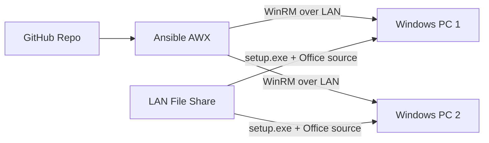

# MS Office 2016 LAN Install — Ansible AWX Project

Automated deployment of **Microsoft Office 2016** to Windows systems on your LAN using **Ansible AWX**. Installers are pulled from a network share on each target machine, then installed silently via WinRM.

**GitHub repository:** https://github.com/hussaini-8024/Project.git

> **License note:** You must supply your own legally licensed Office 2016 media (ODT `setup.exe`, `configuration.xml`, and source files). This project does not include Microsoft installers.

---

## Architecture


```mermaid
flowchart LR
  GH[GitHub Repo] --> AWX[Ansible AWX]
  AWX -->|WinRM over LAN| WIN1[Windows PC 1]
  AWX -->|WinRM over LAN| WIN2[Windows PC 2]
  SHARE[LAN File Share] -->|setup.exe + Office source| WIN1
  SHARE -->|setup.exe + Office source| WIN2
```

1. AWX syncs playbooks from GitHub.
2. Job template runs `playbooks/install-office2016.yml` against a Windows inventory.
3. Each Windows host copies Office files from a LAN UNC path and runs a silent install.

---

## Repository layout

```
.
├── playbooks/install-office2016.yml    # Office install (deactivates McAfee first)
├── playbooks/deactivate-mcafee.yml     # Stop McAfee / Trellix real-time antivirus
├── roles/office2016/                   # Install role (LAN copy + silent setup)
├── roles/mcafee/                       # Detect and deactivate McAfee / Trellix
├── inventory/hosts.example.yml         # Example Windows LAN inventory
├── group_vars/windows_lan.yml          # Default Office / LAN / McAfee variables
├── scripts/
│   ├── add-awx-office2016-project.sh   # Register GitHub project in AWX
│   ├── add-awx-windows-host.sh         # Add Windows hosts to AWX inventory
│   └── deactivate-mcafee.ps1           # Same deactivation, run locally as Admin
├── requirements.yml                    # ansible.windows collection
└── ansible.cfg
```

---

## Prerequisites

### LAN file share (on each Windows target)

Place licensed Office 2016 media on a share reachable by all PCs, for example:

```
\\fileserver\software\Office2016\
├── setup.exe              # Office Deployment Tool
├── configuration.xml      # optional (generated if missing)
└── Office\                # optional ODT source folder
    └── ...
```

### Windows targets

- Windows 7 SP1+ / Windows 10 / Windows Server 2012 R2+
- WinRM enabled (HTTP 5985 or HTTPS 5986)
- Account with local admin rights
- Read access to the LAN share

### AWX

- Organization, inventory (Windows hosts), and Machine credential (WinRM)
- Execution environment with `ansible.windows` collection (see `requirements.yml`)

---

## Add GitHub project to AWX (Projects menu)

### Option A — Automated script (recommended)

From Git Bash or WSL on Windows:

```bash
export AWX_URL="https://awx.example.com"
export AWX_TOKEN="your-oauth-token"
export AWX_ORGANIZATION_ID="1"
export AWX_INVENTORY_ID="5"

./scripts/add-awx-office2016-project.sh
```

This creates or updates:

| AWX resource   | Value |
|----------------|-------|
| **Project name** | MS Office 2016 LAN Install |
| **SCM URL** | `https://github.com/hussaini-8024/Project.git` |
| **Branch** | `main` |
| **Job template** | Install MS Office 2016 |
| **Playbook** | `playbooks/install-office2016.yml` |
| **McAfee job template** | Deactivate McAfee Antivirus |
| **McAfee playbook** | `playbooks/deactivate-mcafee.yml` |
| **Schedule** | Weekly (Sunday 02:00 UTC) — optional |

After running the script, open **AWX → Resources → Projects** to confirm the GitHub link appears in the project menu.

### Option B — Manual AWX UI

1. **Resources → Projects → Add**
2. **Name:** `MS Office 2016 LAN Install`
3. **SCM type:** Git
4. **SCM URL:** `https://github.com/hussaini-8024/Project.git`
5. **SCM branch:** `main`
6. Enable **Clean** and **Update revision on job launch**
7. **Save** → click **Sync** (cloud icon)

Then create job templates:

1. **Resources → Templates → Add → Add job template**
2. **Name:** `Install MS Office 2016`
3. **Job type:** Run
4. **Inventory:** your Windows LAN inventory
5. **Project:** MS Office 2016 LAN Install
6. **Playbook:** `playbooks/install-office2016.yml`
7. **Credentials:** WinRM machine credential
8. **Extra variables** (example):

```yaml
office2016_lan_source_path: "\\\\fileserver\\software\\Office2016"
```

9. **Save** → **Schedules → Add** for automatic recurring runs

Add a second template the same way:

1. **Name:** `Deactivate McAfee Antivirus`
2. **Playbook:** `playbooks/deactivate-mcafee.yml`
3. Same inventory and WinRM credential
4. **Save** → **Launch** to turn off McAfee on the LAN hosts

---

## Add Windows hosts to AWX inventory

```bash
export AWX_URL="https://awx.example.com"
export AWX_TOKEN="your-token"
export AWX_INVENTORY_ID="5"
export WINRM_PASSWORD="YourAdminPassword"

./scripts/add-awx-windows-host.sh pc01 192.168.1.101
./scripts/add-awx-windows-host.sh pc02 192.168.1.102
```

Or copy `inventory/hosts.example.yml` and import into AWX.

---

## Deactivate McAfee antivirus

McAfee / Trellix real-time scanning often blocks Office `setup.exe`. This project turns that protection off on the Windows LAN hosts you already manage with WinRM.

### From AWX

1. Sync the project, then open **Resources → Templates → Deactivate McAfee Antivirus**
2. Choose your Windows inventory and WinRM machine credential
3. **Launch**

The Office 2016 job template also runs this step first (`office2016_deactivate_mcafee: true`).

### From ansible-playbook

```bash
ansible-playbook playbooks/deactivate-mcafee.yml
```

### On a single PC (no Ansible)

Open an elevated PowerShell prompt on the Windows host:

```powershell
powershell -ExecutionPolicy Bypass -File .\scripts\deactivate-mcafee.ps1
```

The script:

- Detects McAfee / Trellix from installed programs, services, and Windows Security Center
- Stops on-access / threat-prevention services (`McShield`, `mfetp`, and related engines)
- Disables those services at startup so they stay off after reboot
- Stops the McAfee Agent so an ePO policy refresh cannot immediately turn protection back on
- Sets documented on-access `bStartDisabled` registry flags when those keys already exist
- Leaves kernel trust drivers (`mfevtp` / `MFEVTPS`) alone — disabling those can stop Windows from booting

If McAfee **self-protection** blocks the stop, open the McAfee app → **My Protection → Real-Time Scanning → Turn off** (choose never / until you turn it back on), or in VirusScan Console disable **Access Protection → Prevent McAfee services from being stopped**, then rerun. ePO/Trellix-managed PCs also need a policy that turns off on-access scanning, or the console will turn it back on.

| Variable | Default | Description |
|----------|---------|-------------|
| `mcafee_strict` | `true` (standalone playbook) / `false` (Office job) | Fail the job if real-time protection is still running |
| `mcafee_disable_startup` | `true` | Disable automatic start for antivirus engine services |
| `mcafee_stop_agent` | `true` | Stop the McAfee/Trellix management agent |
| `mcafee_disable_firewall` | `false` | Also stop McAfee firewall services |
| `mcafee_disable_webadvisor` | `false` | Also stop McAfee WebAdvisor |
| `office2016_deactivate_mcafee` | `true` | Run deactivation before Office setup |

---

## Run manually (without AWX)

```bash
cp inventory/hosts.example.yml inventory/hosts.yml
# Edit inventory/hosts.yml with your hosts and credentials

ansible-galaxy collection install -r requirements.yml
ansible-playbook playbooks/install-office2016.yml \
  -e office2016_lan_source_path='\\fileserver\software\Office2016'
```

---

## Configuration variables

| Variable | Default | Description |
|----------|---------|-------------|
| `office2016_lan_source_path` | `\\fileserver\software\Office2016` | UNC path to Office media on LAN |
| `office2016_staging_path` | `C:\Temp\Office2016` | Local staging folder on target |
| `office2016_product_id` | `ProPlusRetail` | Office product ID for ODT |
| `office2016_edition` | `64` | `32` or `64` |
| `office2016_language` | `en-us` | Install language |
| `office2016_channel` | `Volume` | ODT channel |
| `office2016_remove_existing` | `false` | Remove existing Office first |
| `office2016_reboot` | `if_required` | Reboot after install (exit 3010) |
| `office2016_deactivate_mcafee` | `true` | Deactivate McAfee / Trellix before setup |

Override in AWX **Extra Variables**, **Survey**, or `group_vars/windows_lan.yml`.

---

## Automatic LAN deployment schedule

The registration script creates a weekly schedule. To change timing in AWX:

1. **Resources → Templates → Install MS Office 2016 → Schedules**
2. Edit RRULE or create a new schedule (e.g. nightly `0 1 * * *`)

Each scheduled run installs Office on all hosts in the inventory that do not already have Office 2016 (idempotent).

---

## Troubleshooting

| Issue | Fix |
|-------|-----|
| LAN share not found | Verify UNC path from target PC; check share permissions for WinRM user |
| WinRM connection failed | Open port 5985; run `winrm quickconfig` on target |
| Setup exit code 3010 | Normal — reboot required; playbook handles when `office2016_reboot: if_required` |
| Project sync failed | Confirm AWX can reach GitHub; use deploy key or credential if private repo |
| McAfee still running / Access denied | Turn off Real-Time Scanning in the McAfee app, or disable Access Protection self-protection, then rerun `playbooks/deactivate-mcafee.yml` |
| McAfee turns back on after a few minutes | Host is likely ePO-managed; stop the agent (`mcafee_stop_agent: true`) and assign a policy that disables on-access scanning |

---

## Links

- **GitHub project:** https://github.com/hussaini-8024/Project.git
- **Playbook:** `playbooks/install-office2016.yml`
- **AWX project script:** `scripts/add-awx-office2016-project.sh`
